[简体中文](README.md) | **English**


# HEIYAN Canvas

A node-based canvas for image, video, audio and 3D creation. Self-host it and connect your own model APIs, Codex and ComfyUI. No canvas account required.

**[Self-host →](docs/QUICKSTART.en.md#self-host-the-canvas)** · [Online demo (ChatGPT-hosted)](https://heiyan.f2vfhjcckr.chatgpt.site/) · [Features](#features) · [Source and contributions](#source-and-contributions)

## Getting started

| What you need | How to start |
| --- | --- |
| Self-host the canvas | Clone the repository, install dependencies and start the app. [Setup instructions](docs/QUICKSTART.en.md#self-host-the-canvas). |
| Try it online | [Open the demo](https://heiyan.f2vfhjcckr.chatgpt.site/), hosted on ChatGPT Sites. Some regions or networks may require a proxy or VPN that you provide. Connect your own API to generate assets. |
| Connect your Codex | Download the Windows portable connector, extract it and run the launcher. [Connection guide](docs/QUICKSTART.en.md#connect-your-own-codex). |

The demo does not provide model accounts or generation credits. Self-hosting does not depend on the demo site; your model APIs and Codex still have their own network access requirements.

The Codex connector connects your own Codex to the canvas. It is not an installer for the entire app.

## Preview

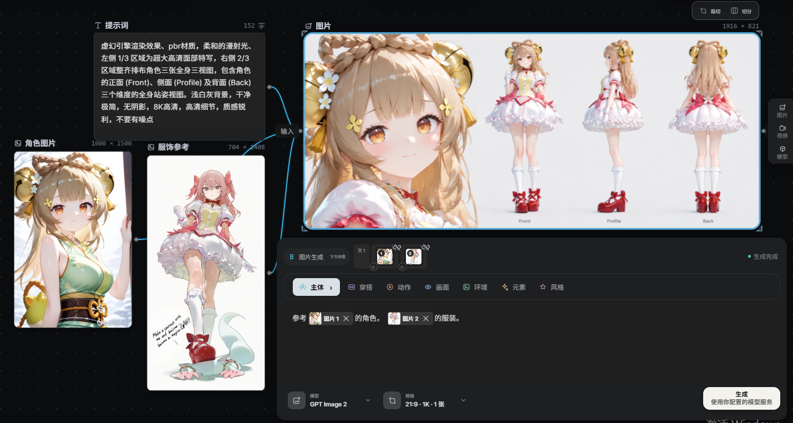

Text + reference images → generated assets → inputs for the next step

| References and results | Model connections | Codex Agent |
| --- | --- | --- |
| [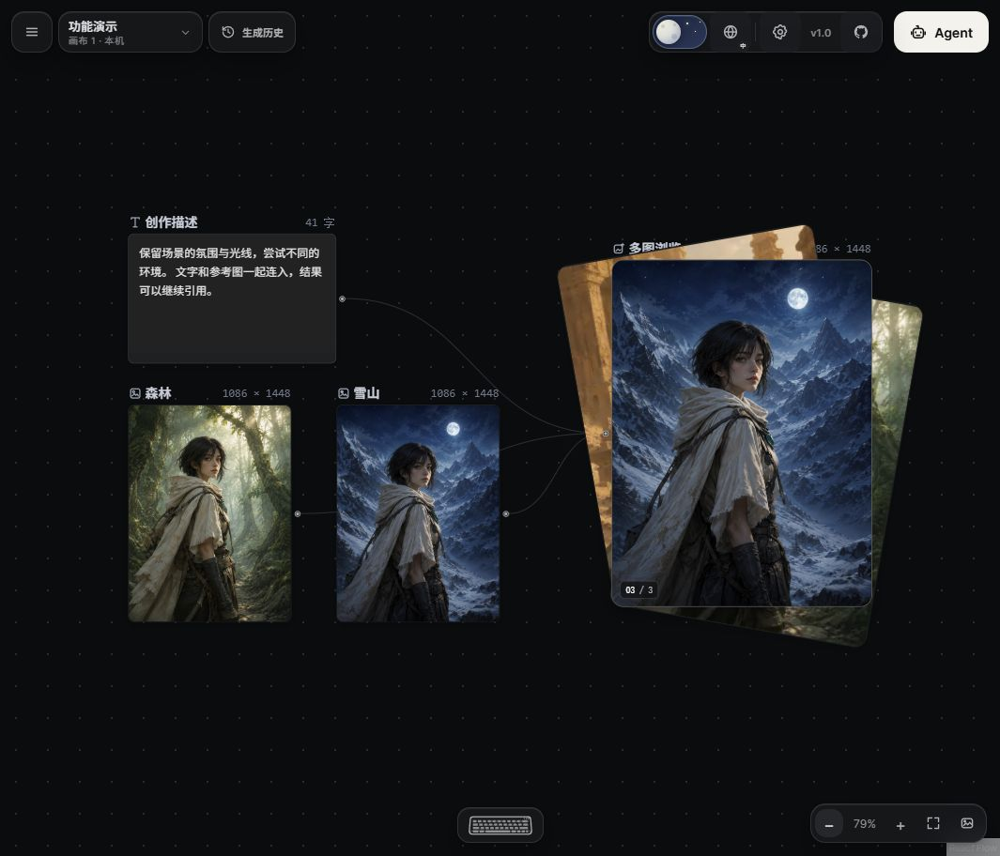](docs/media/reference-hand-detail.jpg) | [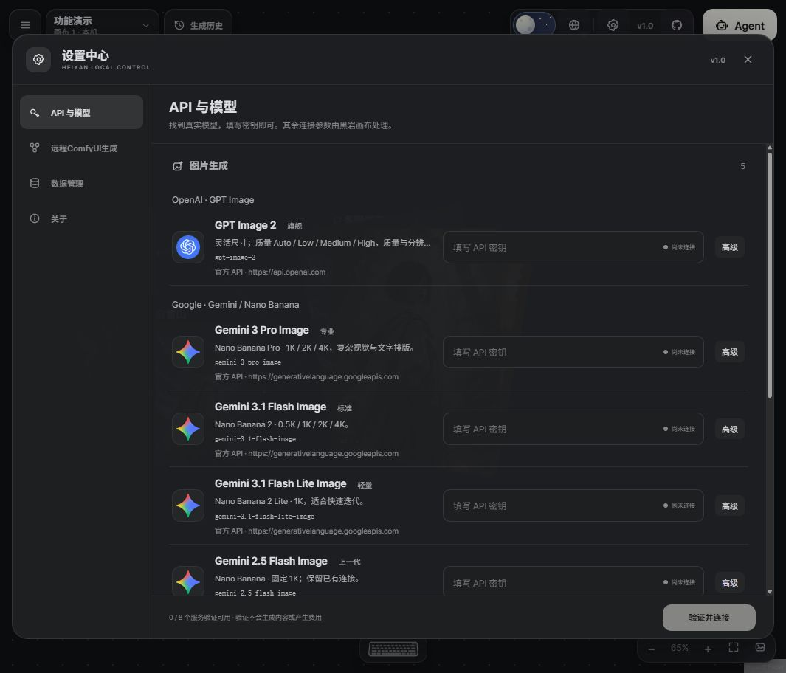](docs/media/model-settings.jpg) | [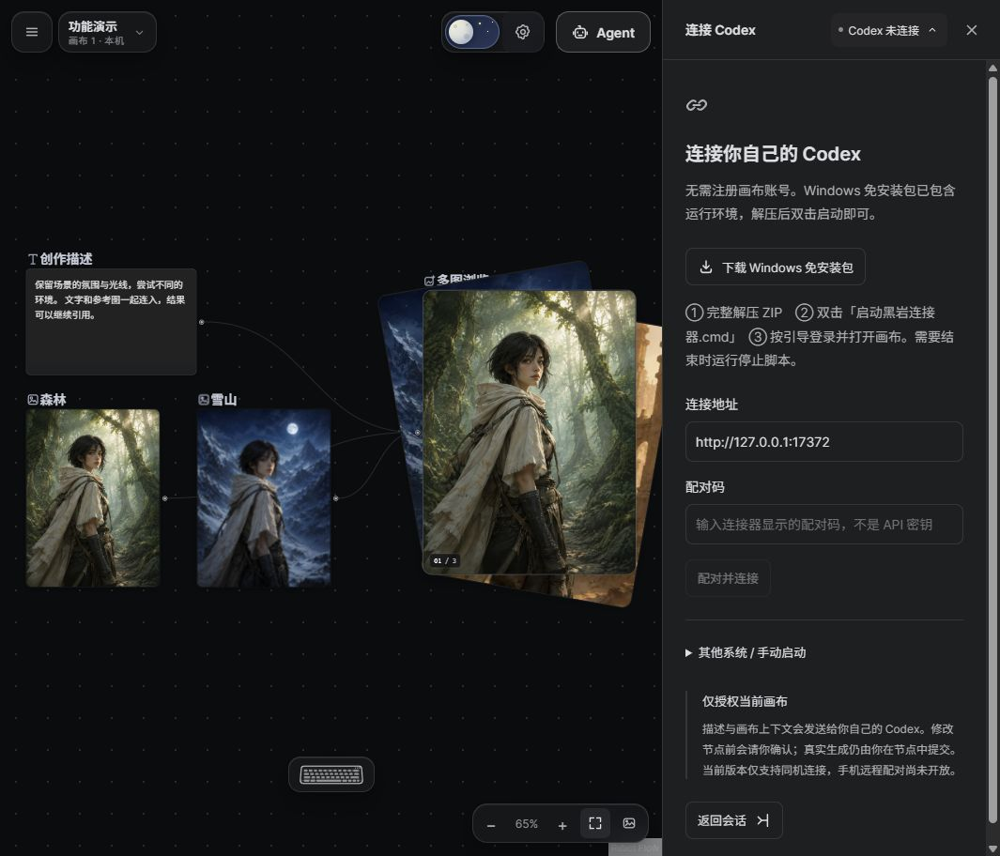](docs/media/agent-connect.jpg) |
| **Prompt assistant** | **Image splitting** | **Advanced API settings** |
| [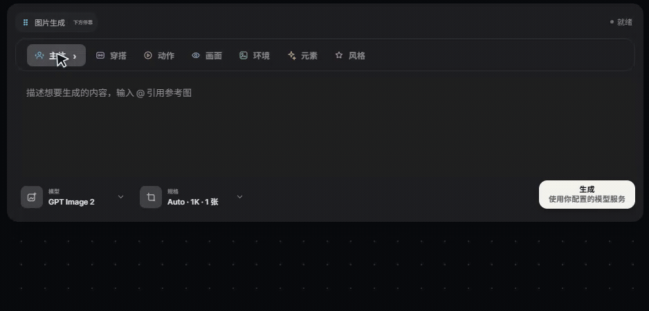](docs/media/prompt-assistant.gif) | [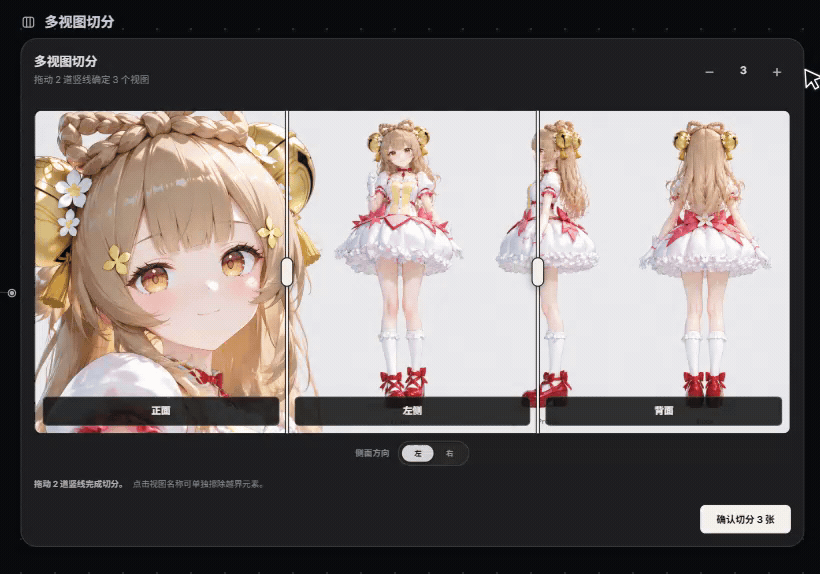](docs/media/multi-view-splitter.gif) | [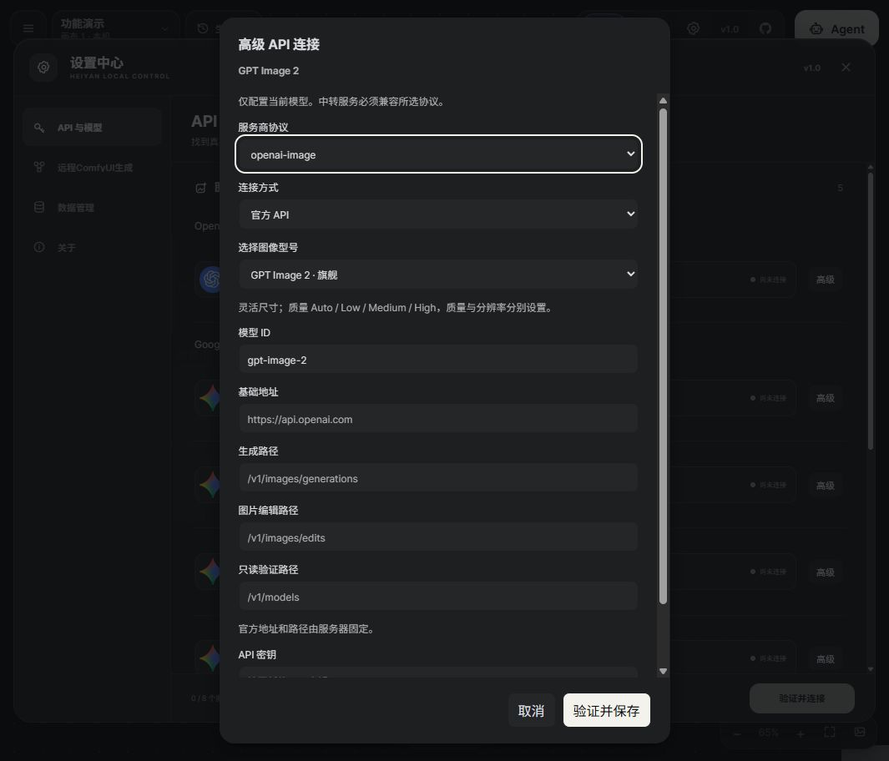](docs/media/api-advanced.jpg) |
| **Day theme** | **Night theme** | **Node alignment** |
| [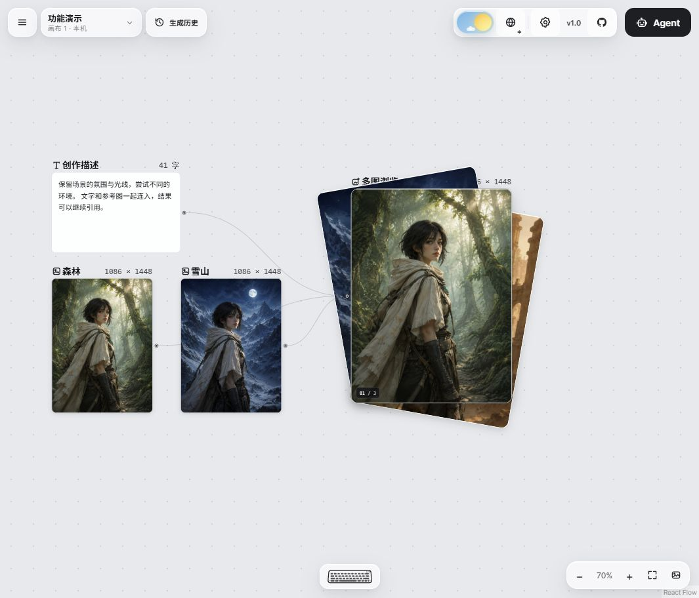](docs/media/canvas-workflow-day.jpg) | [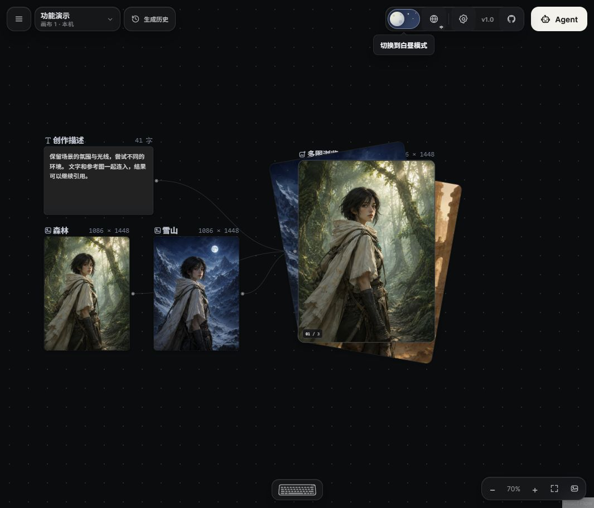](docs/media/canvas-workflow-night.jpg) | [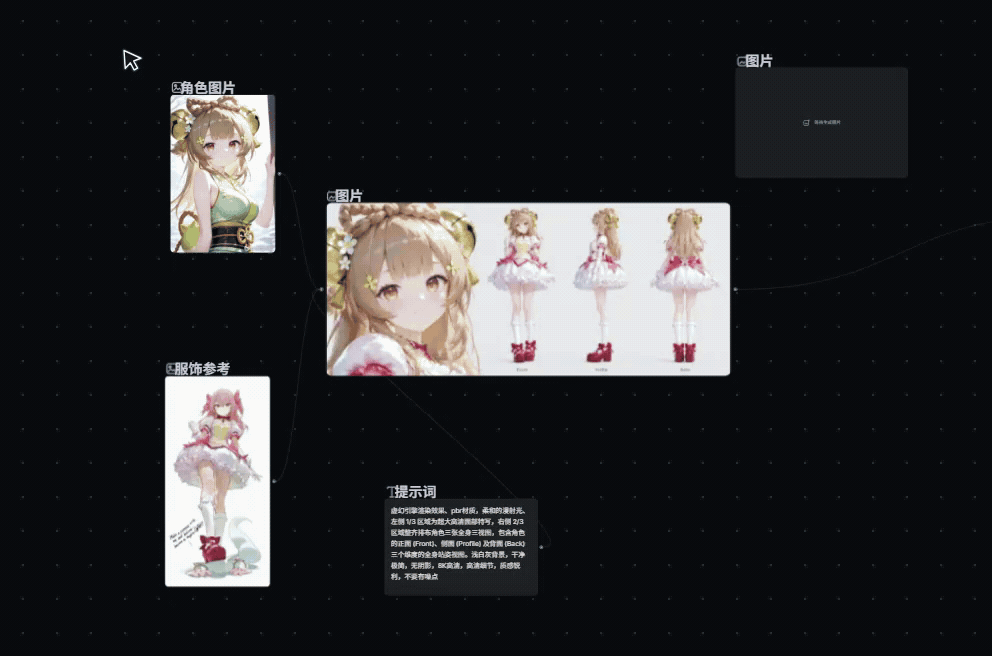](docs/media/node-collision-alignment.gif) |
| **Movable prompt window** | | |
| [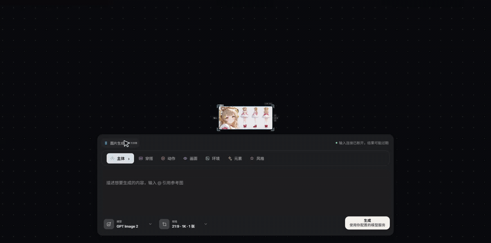](docs/media/prompt-window-drag.gif) | | |

Click a thumbnail to view it at full size. These screenshots show the Chinese interface with demo assets; the connection panels contain no account credentials.

Configure official APIs and compatible third-party endpoints separately. Agent asks before generation by default. Opting into full access allows automatic operations, including paid generation, on the current canvas. This choice is saved per canvas and can be revoked at any time. [1.2 release notes](docs/releases-1.2.md)

## Features

| Area | Available functionality |
| --- | --- |
| Canvas | Pan, zoom, box selection, duplication, groups, batch connections, undo and redo. |
| Inputs | Reference text and different asset types together, subject to the target model's supported inputs. |
| Generation | Images, video, audio and 3D assets; reuse outputs as inputs for subsequent nodes. |
| Image tools | Multi-view splitting, mask editing and overlapping, card-style browsing of multiple results. |
| Generation history | Per-canvas history with deletion and clearing; scroll to zoom and middle-drag to pan previews. |
| Agent | Connect your own Codex or chat API; chat bubbles, attachment thumbnails, image/video result previews, approval and model controls, project memory, history search, node editing and `@` references. |
| ComfyUI | Use your own deployment's models and workflows through a connector, with supported local and cross-network connections. |

## Quick start

Install Node.js 22.13 or later, then run:

```bash
git clone https://github.com/castleinmysky/HEIYAN-Canvas.git
cd HEIYAN-Canvas
npm ci
npm run build
npm start
```

Open [http://127.0.0.1:8792](http://127.0.0.1:8792). Canvas editing works without starting ComfyUI or Codex. Connect the services you need when you want to generate assets.

1. Open your deployment or the [online demo](https://heiyan.f2vfhjcckr.chatgpt.site/). Create nodes or import assets.
2. Connect your own services.
3. Select a model and settings, write a prompt, add references and submit generation.

| Service | What to prepare | Connection panel |
| --- | --- | --- |
| Cloud models | Your API endpoint, model ID and key | Settings → API & Models |
| Codex | Your own Codex login and a running local connector | Agent → Connect Codex |
| ComfyUI | Your models, custom nodes, workflows and connector | Settings → Remote ComfyUI Generation |

See the [English quick-start guide](docs/QUICKSTART.en.md) for API configuration, the Windows connector and ComfyUI setup.

> You use your own API and Codex quota. Canvas data is primarily stored in the current browser, with no automatic cross-device sync. Export important work before changing environments or clearing browser data.

## Project structure

| Directory | Contents |
| --- | --- |
| `src/` | Canvas UI, node interactions, Agent chat and browser-local state. |
| `server/`, `shared/` | Standalone web server, cloud API transport, Codex connector and shared contracts. |
| `local-bridge/` | ComfyUI connector, workflows and adapter engine; no model weights. |
| `public/` | Icons, fonts and built-in demo assets. |
| `docs/` | Setup and connection guides; screenshots and GIFs live in `docs/media/`. |
| `scripts/`, `tests/` | Startup, packaging, release checks and regression tests. |

`node_modules/`, `dist/` and `.runtime*/` are generated during installation, builds or use, and are not committed.

## Limits and data handling

| Area | Details |
| --- | --- |
| Privacy | Cloud services receive the prompts, assets and credentials needed for each request. Configured proxies and tunnels also handle the traffic they forward. |
| Model access | A successful connection does not guarantee access to every model or feature. Provider permissions, quota and deployment configuration still apply. |
| Local services | Keep the connector and ComfyUI running during generation. Clearing browser history does not delete original files on the generation machine. |
| Agent | Image analysis requires a vision-capable model and explicit image sharing. Audio understanding and autonomous film editing are not supported. |
| Session recovery | Project memory can be loaded after reconnecting. This does not resume the original running Codex turn or replay approved operations. Connecting a phone to another computer's Codex is not supported. |
| Refresh recovery | Depends on the provider API. Synchronous requests without background execution cannot be guaranteed to survive a refresh. Uncertain generation submissions are not automatically repeated. |

## Source and contributions

Repository: [castleinmysky/HEIYAN-Canvas](https://github.com/castleinmysky/HEIYAN-Canvas).

You can self-host the canvas, change the interface and extend models or nodes. It uses your own services, not the author's accounts or private model package.

| Scope | Details |
| --- | --- |
| Included | Canvas UI and interactions, model adapters, personal Codex connector, required server code and setup documentation. |
| Not included | Private tasks and generated outputs, account credentials, ComfyUI model weights and LoRAs. |
| Contributions | Report issues, improve documentation and interactions, or extend models and nodes. Include usage instructions and test results with new features. |

Before submitting changes, run `npm run check`, `npm test`, `npm run build` and `npm run check:release`. Use mock services for automated tests; do not submit real generation without the user's approval. Redact credentials, pairing codes and private content from screenshots and logs.

Further repository policies: [Source scope](docs/OPEN-SOURCE.md), [Contributing](CONTRIBUTING.md), [Security](SECURITY.md) and [Third-party notices](THIRD_PARTY_NOTICES.md). These detailed policy documents are currently in Chinese.

## License

Source code is licensed under [Apache License 2.0](LICENSE). Third-party software, fonts, trademarks, models and media remain subject to their respective licenses and terms.
